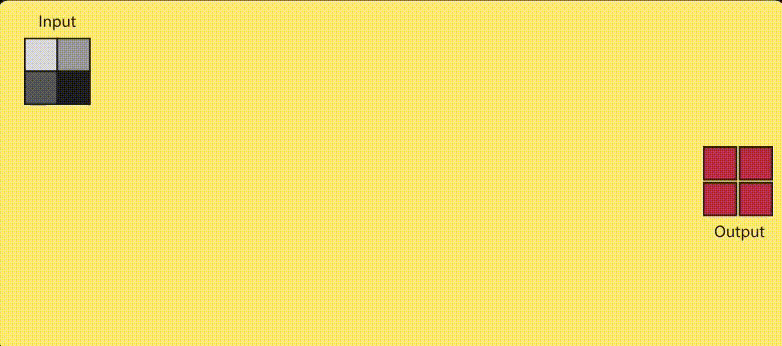
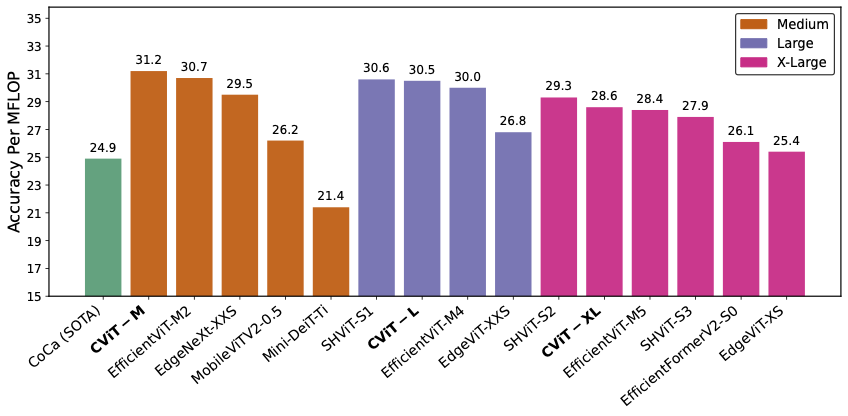

# CascadedViT: Cascaded Chunk-FeedForward and Cascaded Group Attention Vision Transformer

## Overview

This is the official repository of [CascadedViT: Cascaded Chunk-FeedForward and Cascaded Group Attention Vision Transformer](http://arxiv.org/abs/2511.14111) Srivathsan Sivakumar, Faisal Z. Qureshi

CascadedViT uses **Chunk-FFNs with a cascading nature** to produce a family of light-weight, compute-efficient and high-speed vision transformers.

CascadedViT models consistently achieve top-ranking efficiency on a new metric called Accuracy-Per-FLOP (APF), which quantifies compute efficiency relative to accuracy

## Image Classification

CascadedViT models were trained on ImageNet-1K for classification. For further details please refer to [classification](classification).

## Downstream Tasks

ImageNet-1K pretrained CascadedViT-L was used for transfer learning experiments on the MS-COCO dataset for Object Detection and Instance Segmentation. For further details please refer to [downstream](downstream).

## License

Please find our license [here](LICENSE).